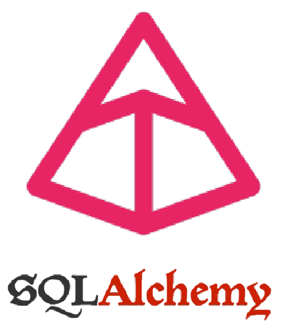

# pydantic-sqlalchemy-tutorial

<!-- Improved compatibility of back to top link: See: https://github.com/othneildrew/Best-README-Template/pull/73 -->
<a name="readme-top"></a>

<!-- PROJECT SHIELDS -->
<!--
*** Markdown "reference style" links for readability.
*** Reference links are enclosed in brackets [ ] instead of parentheses ( ).
-->


<!-- PROJECT LOGO -->
<br />
<div align="center">
  <a href="https://github.com/othneildrew/Best-README-Template">
    
  </a>

<h3 align="center">Pydantic sqlalchemy tutorial</h3>

  <p align="center">
    Pydantic sqlalchemy tutorial
    <br />
    <a href="https://github.com/jpcadena/pydantic-sqlalchemy-tutorial"><strong>Explore the docs »</strong></a>
    <br />
  </p>
</div>


<!-- TABLE OF CONTENTS -->
<details>
  <summary>Table of Contents</summary>
  <ol>
    <li>
      <a href="#about-the-project">About The Project</a>
      <ul>
        <li><a href="#built-with">Built With</a></li>
      </ul>
    </li>
    <li>
      <a href="#getting-started">Getting Started</a>
      <ul>
        <li><a href="#prerequisites">Prerequisites</a></li>
        <li><a href="#installation">Installation</a></li>
      </ul>
    </li>
    <li><a href="#usage">Usage</a></li>
    <li><a href="#contributing">Contributing</a></li>
    <li><a href="#license">License</a></li>
    <li><a href="#contact">Contact</a></li>
  </ol>
</details>


<!-- ABOUT THE PROJECT -->

![Project][project-screenshot]

This tutorial provides a comprehensive guide on leveraging the functionalities of Pydantic and SQLAlchemy within Python applications. Pydantic is utilized primarily for data validation and settings management through data parsing and validation using Python type annotations. SQLAlchemy, on the other hand, serves as a powerful SQL toolkit and Object-Relational Mapping (ORM) system for Python, facilitating database communication more efficiently and intuitively.

The aim of this tutorial is to showcase how these two libraries can be integrated to build robust data processing applications. You'll learn how to validate data effectively with Pydantic and perform database operations seamlessly with SQLAlchemy. Whether you're managing data flows for web development with FastAPI or orchestrating complex data transformations for ETL processes, this guide will provide you with the necessary tools and knowledge to enhance your projects' architecture and data integrity.


This guide is ideal for developers looking to improve their backend systems, data scientists seeking to streamline their data handling, and anyone in between who wishes to master these powerful Python libraries.

<p align="right">(<a href="#readme-top">back to top</a>)</p>

### Built with

[![Python][python-shield]][python-url] [![Pydantic][pydantic-shield]][pydantic-url] [![postgresql][postgresql-shield]][postgresql-url] [![isort][isort-shield]][isort-url] [![Black][black-shield]][black-url] [![Ruff][ruff-shield]][ruff-url] [![MyPy][mypy-shield]][mypy-url] [![pre-commit][pre-commit-shield]][pre-commit-url] [![GitHub Actions][github-actions-shield]][github-actions-url] [![Poetry][poetry-shield]][poetry-url] [![Pycharm][pycharm-shield]][pycharm-url] [![Visual Studio Code][visual-studio-code-shield]][visual-studio-code-url] [![Markdown][markdown-shield]][markdown-url] [![License: MIT][license-shield]][license-url]

<p align="right">(<a href="#readme-top">back to top</a>)</p>

<!-- GETTING STARTED -->

## Getting Started

### Prerequisites

- [Python 3.12+][python-docs]

### Installation

1. Clone the **repository**

   ```bash
   git clone https://github.com/jpcadena/pydantic-sqlalchemy-tutorial.git
   ```

2. Change the directory to **root project**

   ```bash
   cd pydantic-sqlalchemy-tutorial
   ```

3. Install **Poetry** package manager

   ```bash
   pip install poetry
   ```

4. Install the project's **dependencies**

   ```bash
   poetry install
   ```

5. Activate the **environment**

   ```bash
   poetry shell
   ```

<p align="right">(<a href="#readme-top">back to top</a>)</p>

<!-- USAGE EXAMPLES -->

## Usage

1. **Setting up environment variables:**

   If you find a `.env.sample` in the project directory, make a copy of it and rename to `.env`.

   ```bash
   cp .env.sample .env
   ```

   This `.env` file will be used to manage your application's environment variables.

2. **Configuring your credentials:**

   Open the `.env` file in a text editor and replace the placeholder values with your actual credentials.

   ```bash
   # .env file
   POSTGRES_USER=your_database_user
   SECRET_KEY=your_api_key
   ```

3. Execute with console

   ```bash
   python main.py
   ```

<p align="right">(<a href="#readme-top">back to top</a>)</p>

<!-- CONTRIBUTING -->

## Contributing

[![GitHub][github-shield]][github-url]

Please read our [contributing guide](CONTRIBUTING.md) for details on our code of conduct, and the process for submitting pull requests to us.

<p align="right">(<a href="#readme-top">back to top</a>)</p>

<!-- SECURITY -->

## Security

For security considerations and best practices, please refer to our [Security Guide](SECURITY.md) for a detailed guide.

<p align="right">(<a href="#readme-top">back to top</a>)</p>

<!-- CODE_OF_CONDUCT -->

## Code of Conduct

We enforce a code of conduct for all maintainers and contributors. Please read our [Code of Conduct](CODE_OF_CONDUCT.md) to understand the expectations before making any contributions.

<p align="right">(<a href="#readme-top">back to top</a>)</p>

<!-- LICENSE -->

## License

Distributed under the MIT License. See [LICENSE](LICENSE) for more information.

<p align="right">(<a href="#readme-top">back to top</a>)</p>

<!-- CONTACT -->

## Contact

- [![LinkedIn][linkedin-shield]][linkedin-url]

- [![Outlook][outlook-shield]](mailto:jpcadena@espol.edu.ec?subject=[GitHub]pydantic-sqlalchemy-tutorial)

<p align="right">(<a href="#readme-top">back to top</a>)</p>

<!-- MARKDOWN LINKS & IMAGES -->
<!-- https://www.markdownguide.org/basic-syntax/#reference-style-links -->

[project-screenshot]: assets/images/project.png
[python-docs]: https://docs.python.org/3.12/
[linkedin-shield]: https://img.shields.io/badge/linkedin-%230077B5.svg?style=for-the-badge&logo=linkedin&logoColor=white
[outlook-shield]: https://img.shields.io/badge/Microsoft_Outlook-0078D4?style=for-the-badge&logo=microsoft-outlook&logoColor=white
[python-shield]: https://img.shields.io/badge/python-3670A0?style=for-the-badge&logo=python&logoColor=ffdd54
[pycharm-shield]: https://img.shields.io/badge/PyCharm-21D789?style=for-the-badge&logo=pycharm&logoColor=white
[markdown-shield]: https://img.shields.io/badge/Markdown-000000?style=for-the-badge&logo=markdown&logoColor=white
[github-shield]: https://img.shields.io/badge/github-%23121011.svg?style=for-the-badge&logo=github&logoColor=white
[ruff-shield]: https://img.shields.io/endpoint?url=https://raw.githubusercontent.com/charliermarsh/ruff/main/assets/badge/v1.json
[black-shield]: https://img.shields.io/badge/code%20style-black-000000.svg?style=for-the-badge&logo=appveyor
[mypy-shield]: https://img.shields.io/badge/mypy-checked-2A6DB2.svg?style=for-the-badge&logo=appveyor
[visual-studio-code-shield]: https://img.shields.io/badge/Visual_Studio_Code-007ACC?style=for-the-badge&logo=visual-studio-code&logoColor=white
[poetry-shield]: https://img.shields.io/endpoint?url=https://raw.githubusercontent.com/python-poetry/website/main/static/badge/v0.json
[isort-shield]: https://img.shields.io/badge/%20imports-isort-%231674b1?style=flat&labelColor=ef8336
[github-actions-shield]: https://img.shields.io/badge/github%20actions-%232671E5.svg?style=for-the-badge&logo=githubactions&logoColor=white
[pre-commit-shield]: https://img.shields.io/badge/pre--commit-F7B93E?style=for-the-badge&logo=pre-commit&logoColor=white
[pydantic-shield]: https://img.shields.io/badge/Pydantic-FF43A1?style=for-the-badge&logo=pydantic&logoColor=white
[postgresql-shield]: https://img.shields.io/badge/PostgreSQL-336791?style=for-the-badge&logo=postgresql&logoColor=white
[license-shield]: https://img.shields.io/badge/License-MIT-yellow.svg

[linkedin-url]: https://linkedin.com/in/juanpablocadenaaguilar
[python-url]: https://docs.python.org/3.12/
[pycharm-url]: https://www.jetbrains.com/pycharm/
[markdown-url]: https://daringfireball.net/projects/markdown/
[github-url]: https://github.com/jpcadena/pydantic-sqlalchemy-tutorial
[ruff-url]: https://beta.ruff.rs/docs/
[black-url]: https://github.com/psf/black
[mypy-url]: http://mypy-lang.org/
[visual-studio-code-url]: https://code.visualstudio.com/
[poetry-url]: https://python-poetry.org/
[isort-url]: https://pycqa.github.io/isort/
[github-actions-url]: https://github.com/features/actions
[pre-commit-url]: https://pre-commit.com/
[pydantic-url]: https://docs.pydantic.dev
[postgresql-url]: https://www.postgresql.org/
[license-url]: https://opensource.org/licenses/MIT
